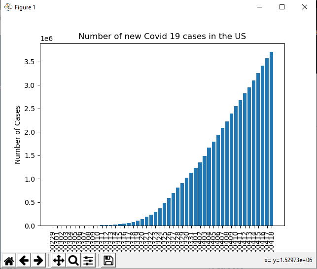

# Covid19-Tracker
This is a simple program written in python that gets the number of new Covid-19 cases from a api, and graphs them using matplotlib. 

Make sure you have requests and matplotlib installed on your machine. The dates on the bottom on the graphs are not formatted yet. 

## Example image:

